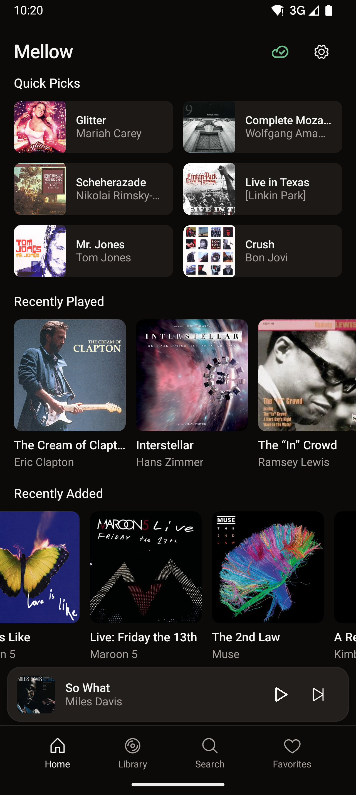
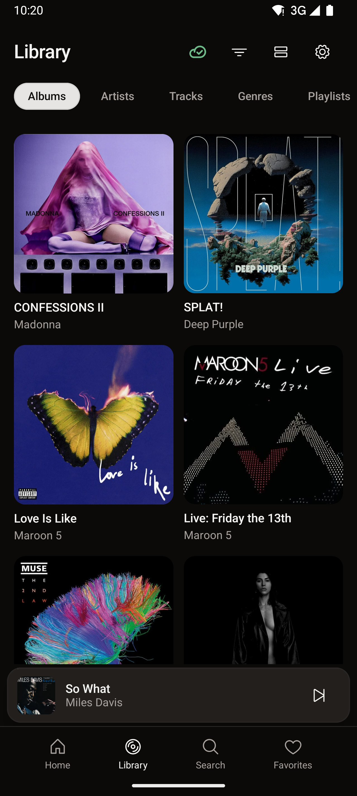
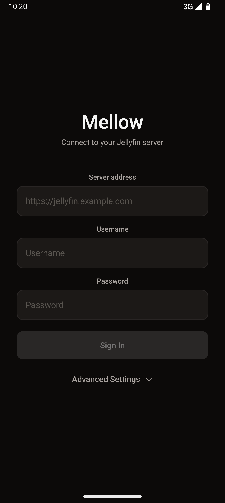
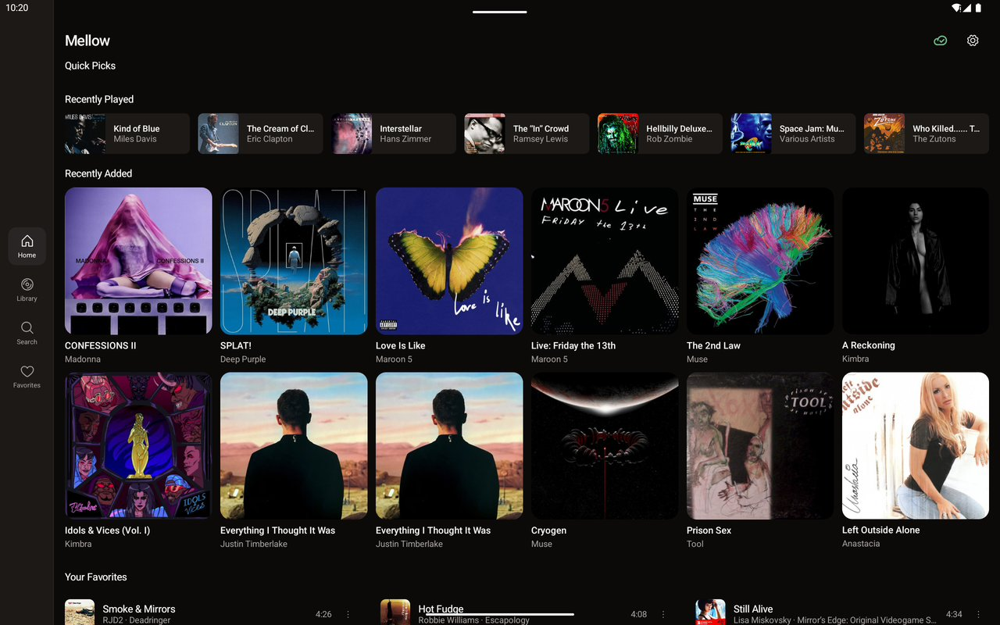

# Mellow

A fast, offline-first [Jellyfin](https://jellyfin.org/) music player for Android with first-class Android Auto support.

📖 [Read the story behind Mellow](https://blog.marathonlabs.io/blog/dogfooding-emu-building-mellow/)

<p align="center">
  
  
  
</p>

<p align="center">
  
</p>

## Why

Every open-source Jellyfin music client I've tried has the same gaps: background playback breaks on modern Android, offline is an afterthought, and Android Auto is perpetually "coming soon." Mellow fixes all three.

## Features

- **Offline-first** — all metadata synced to a local Room database. Music downloads with configurable WiFi-only and storage caps
- **Android Auto** — full browse tree, playback
- **Background playback** — MediaLibraryService with proper foreground service lifecycle on Android 12+
- **Lyrics** — synced LRC with tap-to-seek
- **Responsive** — single-column on phones, nav rail + multi-column on tablets, landscape layouts
- **Battery-aware** — GPU shader album backdrops pause when battery is low

## Built with Emu

Mellow was developed and tested using [Emu](https://emu.marathonlabs.io/?utm_source=github&utm_medium=mellow&utm_campaign=emu-dogfooding), an Android emulator companion tool.

<video src="docs/emu-demo.mp4" autoplay muted loop playsinline width="720"></video>

[Try Emu →](https://emu.marathonlabs.io/?utm_source=github&utm_medium=mellow&utm_campaign=emu-dogfooding)

Emu provides device mirroring, MCP tools for automation, Android Auto projection, battery/network mocking, and quality video recording — all of which were used daily while building this app.

<video src="docs/aa-demo.mp4" autoplay muted loop playsinline width="720"></video>

The Android Auto implementation was tested entirely through Emu's built-in AA projection (no DHU or real car needed). Offline mode was verified by toggling network profiles. Battery-aware animations were tested by setting battery level to any value on demand. [See the full demo videos in the blog post.](https://blog.marathonlabs.io/blog/dogfooding-emu-building-mellow/)

## Tech stack

```
Kotlin · Jetpack Compose · Material 3 · Media3 (ExoPlayer)
Hilt · Room · Coil · WorkManager · jellyfin-sdk-kotlin
```

## Build

```bash
./gradlew assembleDebug
adb install app/build/outputs/apk/debug/app-debug.apk
```

## Screenshot tests

168 screenshot test cases across 4 device configurations (Pixel 10 portrait/landscape, Pixel Tablet portrait/landscape). Run via Robolectric with native graphics rendering:

```bash
./gradlew :app:testDebugUnitTest --tests "dev.mellow.app.screenshot.*"
```

Baselines live in `.marathon-snapshots/` and are compared via (internal as of this moment) version of [Marathon Cloud](https://marathonlabs.io).

## License

Apache License 2.0. See [LICENSE](LICENSE).
