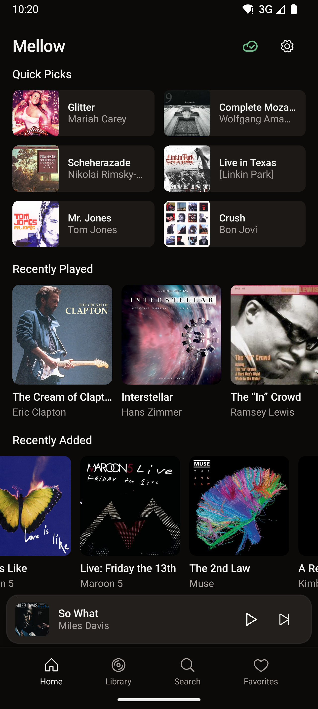
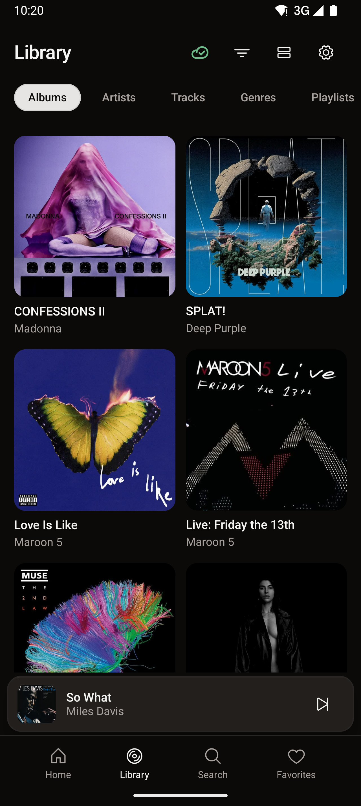
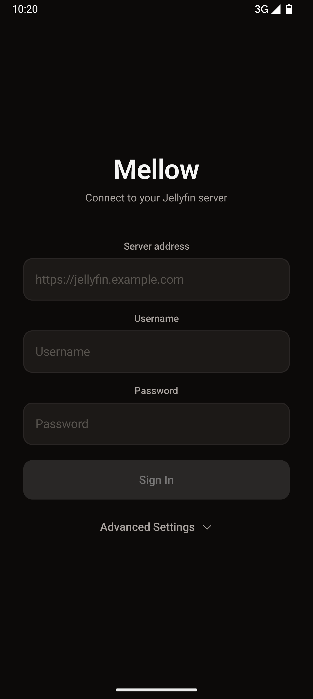
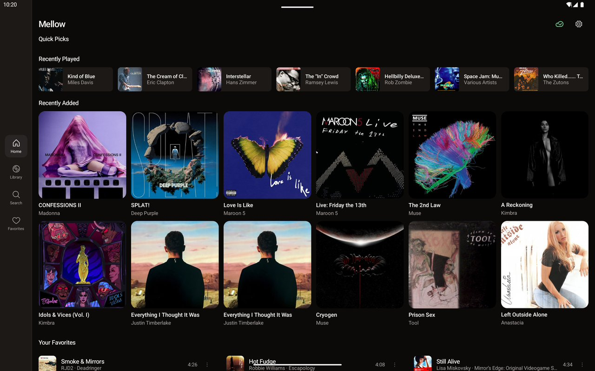
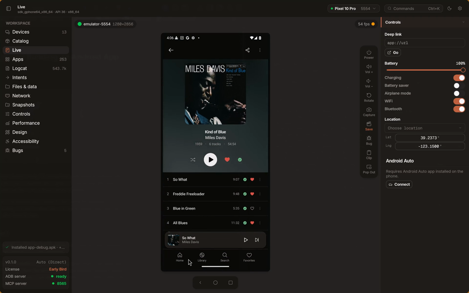
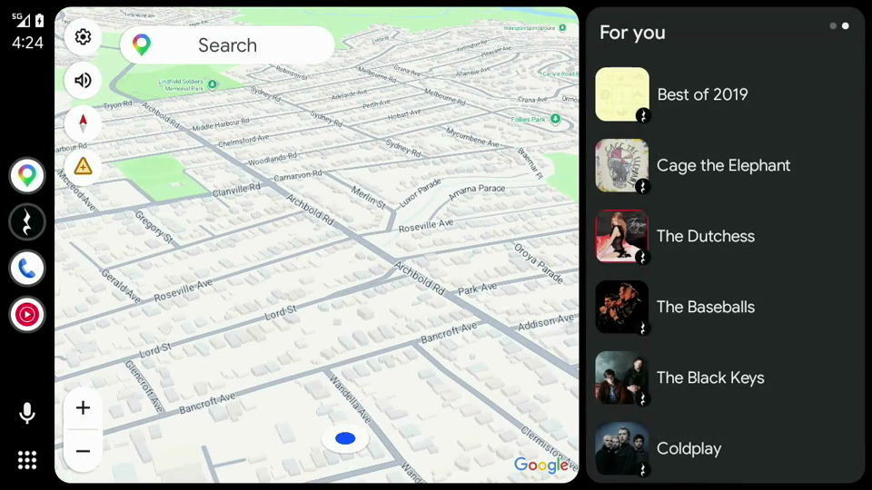

# Mellow

A fast, offline-first [Jellyfin](https://jellyfin.org/) music player for Android with first-class Android Auto support.


📖 [Read the story behind Mellow](https://blog.marathonlabs.io/blog/dogfooding-emu-building-mellow/)

<p align="center">
  
  
  
</p>

<p align="center">
  
</p>

## Why

Every open-source Jellyfin music client I've tried has the same gaps: background playback breaks on modern Android, offline is an afterthought, and Android Auto is perpetually "coming soon." Mellow fixes all three.

## Features

- **Offline-first** — all metadata synced to a local Room database. Music downloads with configurable WiFi-only and storage caps
- **Android Auto** — full browse tree, playback
- **Background playback** — MediaLibraryService with proper foreground service lifecycle on Android 12+
- **Lyrics** — synced LRC with tap-to-seek
- **Responsive** — single-column on phones, nav rail + multi-column on tablets, landscape layouts
- **Battery-aware** — GPU shader album backdrops pause when battery is low

## Built with Emu

Mellow was developed and tested using [Emu](https://emu.marathonlabs.io/?utm_source=github&utm_medium=mellow&utm_campaign=emu-dogfooding), an Android emulator companion tool.

<p align="center">
  <a href="https://blog.marathonlabs.io/blog/dogfooding-emu-building-mellow/">
    
  </a>
</p>

▶️ [Watch the demo](https://blog.marathonlabs.io/blog/dogfooding-emu-building-mellow/) · [Try Emu](https://emu.marathonlabs.io/?utm_source=github&utm_medium=mellow&utm_campaign=emu-dogfooding)

Emu provides device mirroring, MCP tools for automation, Android Auto projection, battery/network mocking, and quality video recording — all of which were used daily while building this app.

<p align="center">
  <a href="https://blog.marathonlabs.io/blog/dogfooding-emu-building-mellow/">
    
  </a>
</p>

The Android Auto implementation was tested entirely through Emu's built-in AA projection (no DHU or real car needed). Offline mode was verified by toggling network profiles. Battery-aware animations were tested by setting battery level to any value on demand. [See the full demo videos in the blog post.](https://blog.marathonlabs.io/blog/dogfooding-emu-building-mellow/)

## Tech stack

```
Kotlin · Jetpack Compose · Material 3 · Media3 (ExoPlayer)
Hilt · Room · Coil · WorkManager · jellyfin-sdk-kotlin
```

## Install

Download the latest APK from [GitHub Releases](https://github.com/Malinskiy/mellow/releases/latest):

1. Download `app-release.apk` from the latest release
2. Transfer the APK to your Android device (or download directly on device)
3. Open the APK and install — you may need to allow installation from unknown sources in your device settings

### Updating

Mellow checks GitHub Releases for a newer version at most once a day when it launches (toggle in
Settings › About › "Check for updates automatically"; "Check for updates" runs it on demand). Updates download
and install in-app: the APK is checked against the release's SHA-256 and must be signed with the same key as the
installed build before Android's installer is opened. The first time, Android asks once to allow installs from
Mellow. Use "Skip this version" in the update dialog to silence a release you don't want.

### Installing on Google-certified devices (developer verification)

Mellow is **not** registered with Google's
[Android developer verification](https://developer.android.com/developer-verification/guides/faq) program. On
certified devices where verification is enforced (Brazil, Indonesia, Singapore and Thailand since 2026-09-30;
everywhere from 2027) you need one of:

- **The one-time "advanced flow"**: Settings › Developer options › enable installs from unverified developers
  (if Developer options is missing: About phone › tap Build number 7 times), confirm, restart, and wait 24 hours.
  Pick "indefinitely" when asked — with the 7-day option, updates stop working after it lapses. Every install then
  shows an "unverified developer" warning with "Install anyway". When Android blocks an update, Mellow's update
  dialog walks you through these steps and keeps the downloaded APK so you can install it after the wait.
- **ADB**: `adb install -r app-release.apk` from a computer. ADB installs are exempt from verification and the wait.

De-Googled devices (GrapheneOS, LineageOS without Play Services, …) are unaffected.

## Build from source

```bash
./gradlew assembleDebug
adb install app/build/outputs/apk/debug/app-debug.apk
```

## Android Auto

Since Mellow is installed outside the Play Store, you need to enable unknown sources in Android Auto:

1. Open the **Android Auto** app on your phone
2. Tap **Settings** → scroll to **Version** → tap it **10 times** to enable developer mode
3. Tap the **⋮** overflow menu (top-right) → **Developer settings**
4. Enable **Unknown sources**

Without this, Android Auto will not show sideloaded apps in the car display.

## Screenshot tests

168 screenshot test cases across 4 device configurations (Pixel 10 portrait/landscape, Pixel Tablet portrait/landscape). Run via Robolectric with native graphics rendering:

```bash
./gradlew :app:testDebugUnitTest --tests "dev.mellow.app.screenshot.*"
```

Baselines live in `.marathon-snapshots/` and are compared via (internal as of this moment) version of [Marathon Cloud](https://marathonlabs.io).

## License

Apache License 2.0. See [LICENSE](LICENSE).
